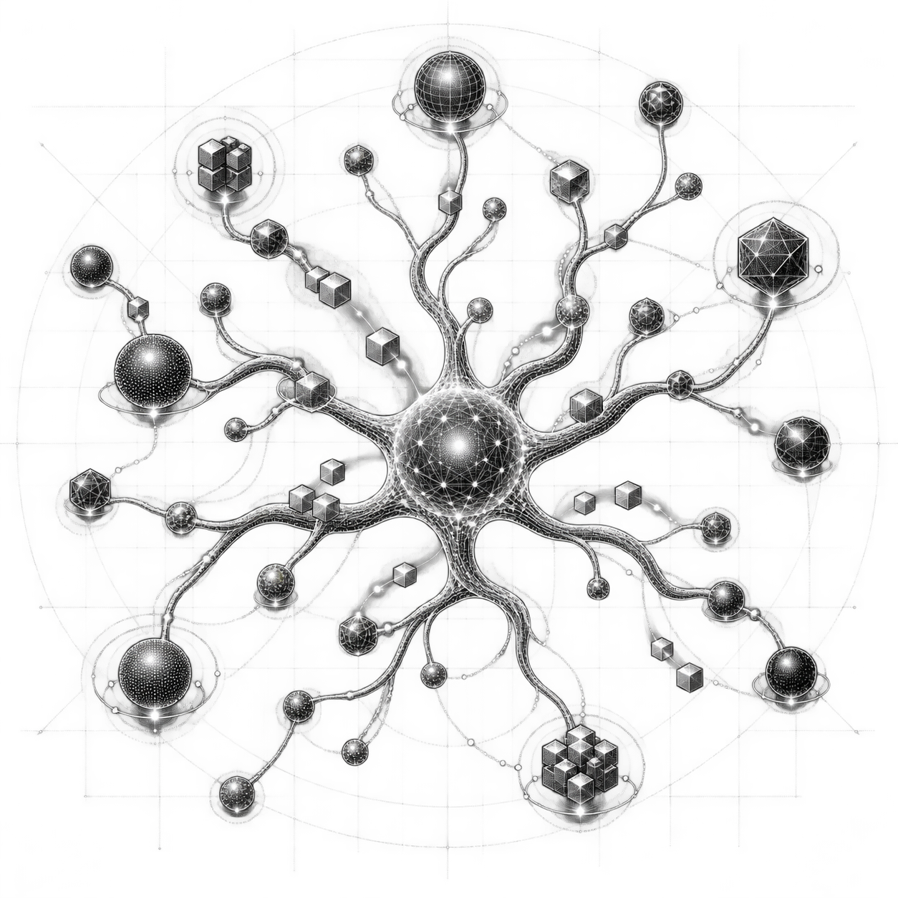

<h1 align="center">
  <br>
  dendrite
</h1>

<p align="center">
  A headless BitTorrent daemon and CLI.
</p>

Dendrite is a BitTorrent daemon (`dendrite`) and a CLI (`dendritectl`).
The daemon holds torrent state, talks to the swarm, verifies data, and
exposes a versioned HTTP/WebSocket API. The CLI authenticates to that
API. There is no GUI.

This is alpha. It is not a hardened isolation boundary and not a
drop-in replacement for a desktop client.
[Status and limitations](docs/reference/status-limitations.md)
separates implemented paths from unsupported behavior.

## Import your first torrent

From a clean checkout, build the daemon and CLI:

```sh
cargo build --release --locked -p dendrite-daemon -p dendrite-cli
```

Start the daemon from the repository root:

```sh
target/release/dendrite
```

It creates `./dendrite-data`, `./downloads`, and an administrator token at
`./dendrite-data/admin.token`. In a second terminal, from the same directory:

```sh
target/release/dendritectl status
target/release/dendritectl add ./example.torrent --start
target/release/dendritectl add ./example.torrent --start --stop-on-complete
target/release/dendritectl set <torrent-id> --stop-on-complete
```

`example.torrent` is a metainfo file you already have; the repository does
not bundle one. A magnet works too—quote it so the shell does not interpret
`&`:

```sh
target/release/dendritectl add 'magnet:?xt=urn:btih:…' --start
```

The add command prints the torrent UUID and initial state as JSON. Files
land in `./downloads`; service state stays in `./dendrite-data`. The
[first-torrent playbook](docs/playbooks/first-torrent.md) covers expected
states, management commands, failures, and cleanup.

## Current project shape

| Surface | Current path | Important boundary |
|---|---|---|
| Metadata | v1, v2, and hybrid metainfo; v1/v2 magnets | malformed, non-canonical, unsafe-path, and inconsistent hybrid metadata is rejected |
| Discovery | HTTP(S) and UDP trackers, DHT, LSD, PEX | no built-in DHT bootstrap list; private torrents suppress DHT, LSD, and PEX |
| Transport | TCP and uTP; MSE preferred with plaintext fallback; BEP 55 hole punching | encryption is transport obfuscation, not anonymity; NAT-PMP needs an explicit IPv4 gateway; no UPnP |
| Transfer | streaming multi-source discovery, inbound peer promotion, contribution-aware choking, rarest-first, up to 256 peers, 128-block pipelines, endgame, seeding; HTTP(S) web seeds | no per-torrent destination, sequential mode, ratio target, or bandwidth policy in API v2.0; web seeds reject non-public addresses |
| Integrity | v1 SHA-1 pieces, v2 SHA-256 Merkle pieces and proofs, hybrid double verification | completion is persisted only after verified payload files are synced |
| Control | authenticated REST API, WebSocket events, Prometheus metrics, OpenAPI, `dendritectl` | the CLI is a smaller surface than the HTTP API; no web UI; OpenAPI is hand-maintained and incomplete |
| Persistence | transactional `redb` records and hash indexes | schema is alpha; upgrade and downgrade compatibility are not promised |
| Storage | path-confined positional I/O; io_uring on Linux with portable fallback | one global download root; remove drops service state, not payload files |

## I want to…

- **Install it:** [Getting started](docs/getting-started/overview.md) and
  [Building and installation](docs/getting-started/building.md).
- **Run it in a container:** [Docker playbook](docs/playbooks/docker.md).
- **Install an always-on Linux service:** [systemd playbook](docs/playbooks/systemd.md).
- **Tune directories, listeners, limits, or encryption:**
  [configuration guide](docs/getting-started/configuration.md), then the
  [configuration reference](docs/reference/configuration.md).
- **Manage torrents:** [Torrent management](docs/operations/torrent-management.md)
  and the [command-line reference](docs/reference/command-line.md).
- **Control it from another machine:** [remote API playbook](docs/playbooks/remote-api.md).
- **Diagnose a failed or stalled torrent:** [recovery playbook](docs/playbooks/recover-torrent.md)
  or [Troubleshooting](docs/troubleshooting.md).
- **Monitor health, metrics, events, and logs:**
  [Observability and maintenance](docs/operations/observability.md).
- **Back up state or move the payload root:** [Data layout](docs/reference/data-layout.md).
- **Measure performance:** [Performance and benchmarking](docs/operations/performance.md).
- **Decide if the alpha is a fit:** [Status and limitations](docs/reference/status-limitations.md).
- **Use the HTTP API:** [control-plane architecture](docs/architecture/control-plane.md)
  and [HTTP API reference](docs/reference/http-api.md).
- **Read the internals:** [torrent lifecycle](docs/architecture/torrent-lifecycle.md),
  [protocols](docs/architecture/protocols.md), and
  [storage and security](docs/architecture/storage-security.md).
- **Contribute:** [repository layout](docs/development/repository-layout.md) and
  [verification model](docs/development/verification.md).

## Documentation

Each page owns one topic. This README is the index.

### Start and deploy

- [Getting started](docs/getting-started/overview.md)
- [Building and installation](docs/getting-started/building.md)
- [Configuration guide](docs/getting-started/configuration.md)
- [First torrent](docs/playbooks/first-torrent.md)
- [Docker](docs/playbooks/docker.md)
- [systemd](docs/playbooks/systemd.md)
- [Remote API](docs/playbooks/remote-api.md)
- [Torrent recovery](docs/playbooks/recover-torrent.md)

### Operate

- [Torrent management](docs/operations/torrent-management.md)
- [Observability and maintenance](docs/operations/observability.md)
- [Performance and benchmarking](docs/operations/performance.md)
- [Troubleshooting](docs/troubleshooting.md)

### Architecture

- [Architecture overview](docs/architecture/overview.md)
- [Control plane](docs/architecture/control-plane.md)
- [Torrent lifecycle](docs/architecture/torrent-lifecycle.md)
- [Protocols](docs/architecture/protocols.md)
- [Storage and security](docs/architecture/storage-security.md)

### Reference

- [Command line](docs/reference/command-line.md)
- [Configuration](docs/reference/configuration.md)
- [Environment variables](docs/reference/environment-variables.md)
- [HTTP API](docs/reference/http-api.md)
- [Data layout](docs/reference/data-layout.md)
- [Status and limitations](docs/reference/status-limitations.md)

### Develop

- [Repository layout](docs/development/repository-layout.md)
- [Verification model](docs/development/verification.md)
- [Documentation policy](docs/documentation-policy.md)

## Default local footprint

| Item | Default |
|---|---|
| API | `http://127.0.0.1:8412/api/v2` |
| TCP and uTP peer listener | `0.0.0.0:16493` |
| DHT UDP listener | `0.0.0.0:16309` |
| Service state | `./dendrite-data` |
| Payload files | `./downloads` |
| Administrator token | `./dendrite-data/admin.token` |
| Database | `./dendrite-data/state.redb` |

The API is loopback-only by default. A non-loopback API address is rejected
unless both TLS files and at least one allowed browser origin are configured.
Peer and DHT listeners are separate from the administrator API.

## Quality gates

CI pins Rust 1.94.0 and runs on Linux:

```sh
cargo fmt --all -- --check
cargo check --workspace --all-targets --all-features --locked
cargo clippy --workspace --all-targets --all-features --locked -- -D warnings
cargo test --workspace --all-targets --all-features --locked
cargo run --locked -p dendrite-simulator -- \
  --seed 24301 \
  --pieces 4096 \
  --peers 64 \
  --corruption-per-mille 100 \
  --churn-per-mille 100
cargo bench --locked -p dendrite-benchmarks --no-run
cargo check --locked --manifest-path fuzz/Cargo.toml --bins
cargo deny check
```

Evidence rules live in the [verification model](docs/development/verification.md).

## Before you adopt this

- Schema is alpha. Do not expect upgrades or downgrades to work.
- Linux is what CI tests. Other operating systems are not claimed.
- The administrator token is full control of the service.

## Name

A dendrite is a branching structure that receives and propagates signals.
The name is the peer graph.

## License

Dendrite is available under the [ISC license](LICENSE).
